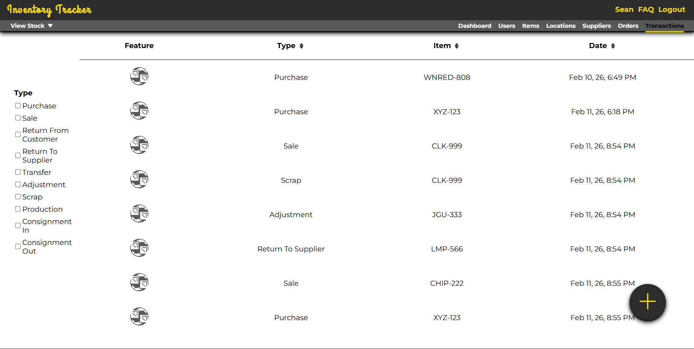
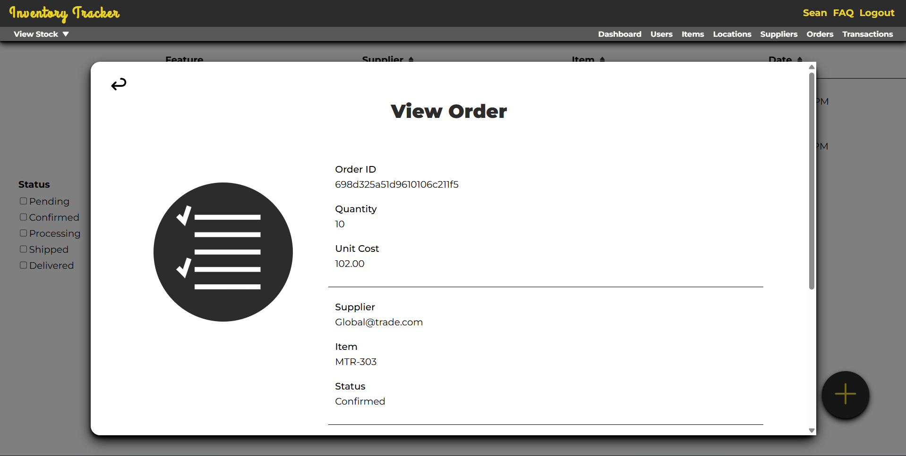
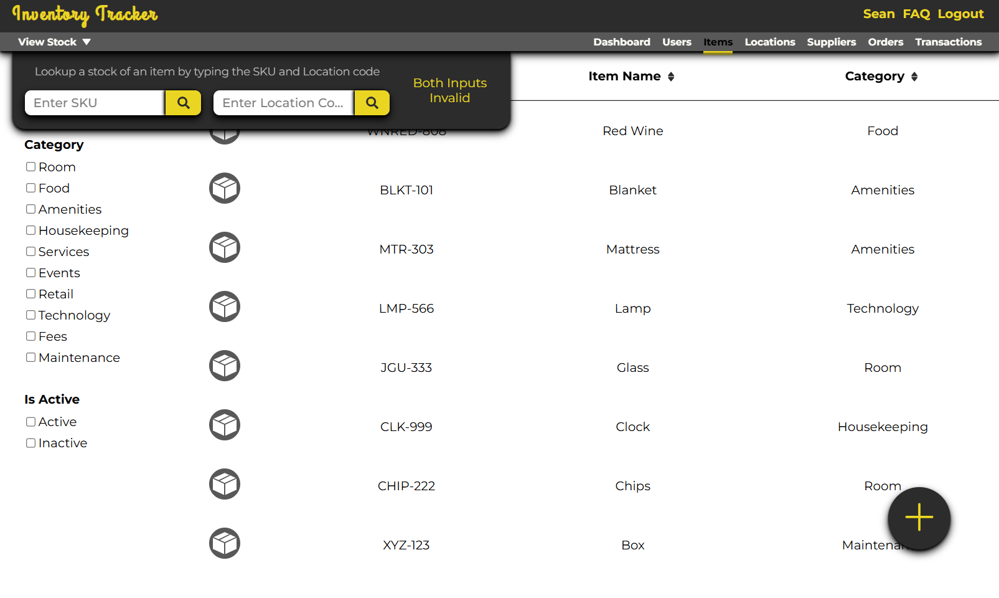

# Inventory Tracker

A hospitality-focused inventory management system that allows users to track **items, orders, shipments, refunds, and transactions**, built using the **MERN stack**.

🌐 **Live Demo:** https://inventory-tracker-mu-roan.vercel.app  
📌 **GitHub Repo:** https://github.com/seandevlog/inventory-tracker.git  

---

## 🔧 Tech Stack

- **Frontend**: React, React Router, Axios, HTML/CSS/JS  
- **Backend**: Node.js, Express, MongoDB, Mongoose  
- **Auth & Validation**: JWT, Bcrypt, Joi  
- **Uploads**: Multer, Cloudinary  
- **Other**: Dotenv, Cookie Parser, CORS  
- **Version Control**: Git, GitHub  

---

## ✨ Features

### Inventory Management
- Add new inventory items
- Update item details (description, price, category, stock)
- Delete / remove inactive items
- Add item conditions (for tracking special cases)

### Orders, Shipments, and Transactions
- Create and view orders
- Add shipment reviews
- Add refunds
- Create billing entries per item
- View billing history

### Item Summary View
- View a full summary for each item, including:
  - Item details
  - Transactions
  - Order activity
  - Related billing history

---

## 🏗️ Architecture Overview

- **React frontend** communicates with the backend using Axios
- **Express REST API** handles routes and business logic
- **MongoDB + Mongoose** stores inventory + transaction data
- **JWT authentication** is used for user sessions
- **Cloudinary + Multer** handles image uploads

---

## 📸 Screenshots

### Transactions Table

### View Order

### View Stock

---

## ▶️ Run Locally

### 1) Clone the repo

    git clone https://github.com/seandevlog/inventory-tracker.git
    cd inventory-tracker

### 2) Install dependencies

    npm install

### 3) Environment Variables

Create a `.env` file (backend) and add values for:

- MongoDB connection string
- JWT secret
- Cloudinary credentials

### 4) Start the application

    npm run dev

---

## 🧠 What I Learned

This project helped me improve in:

- Building REST APIs using Express
- Designing MongoDB schemas with Mongoose
- Validating data with Joi
- Authentication using JWT + Bcrypt
- Handling file uploads using Multer + Cloudinary
- Structuring a full-stack MERN application
- Writing clearer documentation and devlogs

---

## 🗺️ Roadmap / Future Improvements

Even though the core app is complete, I’m continuing to expand it with new features such as:

- [ ] Improved UI/UX + layout polishing
- [ ] Better search, filters, and sorting for inventory items
- [ ] Reporting and analytics
- [ ] Export features (CSV / PDF)
- [ ] Testing (unit + integration)
- [ ] Improved error handling + edge case coverage

---

## 🧩 Wireframes

Early layout planning was done in Figma.

📁 [View wireframes in GitHub](wireframes)  
🔗 [Open in Figma](https://www.figma.com/design/Z0tkiMeNWfYPXXa3pjQEeA/Inventory-Tracker?node-id=0-1&t=q4bf7N29OjiJG0N6-1)

---

## 🎥 Devlog Videos (YouTube)

📺 [Inventory Tracker Devlog Playlist](https://youtube.com/playlist?list=PL_eXQZHkE70mHCowOK_DIJHH-7c-Lg2KN&si=qcf5qfSHMtmwc609)

I share my journey visually, including:
- What I’m working on
- How I troubleshoot issues
- What I’m learning while building and expanding the app

---

## 📫 Contact

If you'd like to connect, collaborate, or give feedback:

📧 Email: [seanarnedodelossantos@gmail.com](mailto:seanarnedodelossantos@gmail.com)  
🔗 GitHub: [github.com/SeanDevLog](https://github.com/SeanDevLog)

---
